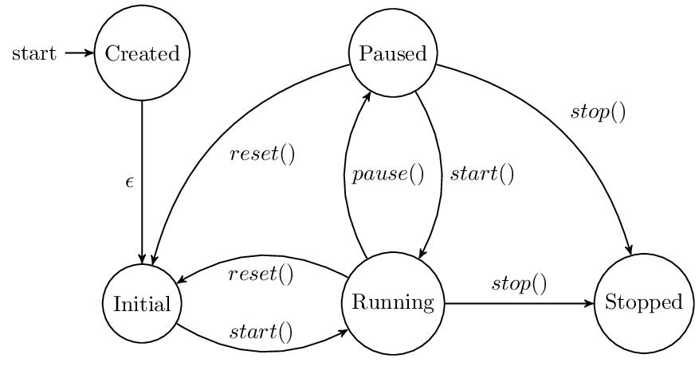

=================
Simulation states
=================

One of the main artifacts of the CLE is the Closed Loop Controller (CLC) that controls the complete
lifecycle of a simulation. In particular, CLC provides a very easy interface how to start, stop and
reset a simulation. To access these features also remotely, the CLE provides some additional classes
that make the functionality of the CLC available through ROS. These adapters use a state machine to
interact with the CLE. Furthermore, the CLE also contains a factory to spawn these simulation servers.
However, this may be refactored since there is no point having two simulation servers in the same
address space.

The simulation server is implemented in the class :class:`hbp_nrp_cle.cle.ROSCLEServer` and the simulation
factory is implemented as :class:`hbp_nrp_cle.cle.ROSCLESimulationFactory`.

State machine of the Closed Loop Controller
-------------------------------------------

.. _state-machine:
.. figure:: img/stateMachine.png
    :align: center

    The state machine of the ClosedLoopEngine

The state machine of our current implementation of the CLC, the :class:`hbp_nrp_cle.cle.ClosedLoopEngine`,
is depicted in :num:`Fig. #state-machine`.

When the CLC is created, no operation is allowed until the CLC has not been initialized. However,
this is not enforced by the implementation, currently.

After the initialization, the CLC is ready to receive commands but no simulation is yet running. A
running simulation can either be triggered by running the simulation for
a fixed timestep using *run_step()* or by starting the CLC using the *start()* method. Beware that
*start()* is a blocking call. Eventually, we can stop the simulation using *stop()*. This method
returns immediately as it simply sets a stop flag. Thus, the CLC is in a state where it is about to
stop after the next simulated step. Similarly, *run_step* sets the CLC in a state where the current
step is simulated and the CLC stops after this request. When the simulation is in a stopped state,
it may be reset using *reset()* or shut down using *shutdown()*. These transitions are also allowed
when the CLC is in running or stopping state. In these cases, the CLC first goes to the stopped state.

ROS CLE Server
--------------

The state machine of the CLE is exposed via ROS through the ROS CLE server. This server basically
exposes the exact same state machine as depicted in :num:`Fig. #state-machine` except that currently
*run_step* is not allowed directly and *start()* returns immediately. Furthermore, there's an
additional state *Paused* which allows transition *start()* back to state *Running* (inside the CLE
*Paused* is handled as *Stopped*). The transition *shutdown()* is not exposed, instead it's called
*stop()* and allowed from *Running* and *Paused*.

.. _state-machine-server:

    The state machine of the ROSCLEServer (internally mapped to the ClosedLoopEngine state machine)

ROS Simulation Factory
----------------------

The ROS Simulation Factory is a factory ROS node that spawns ROS server instances and equips them
with a CLC. This CLC is generated from an experiment description generating code for the transfer
functions that are described using the :doc:`BIBI-configuration`.
