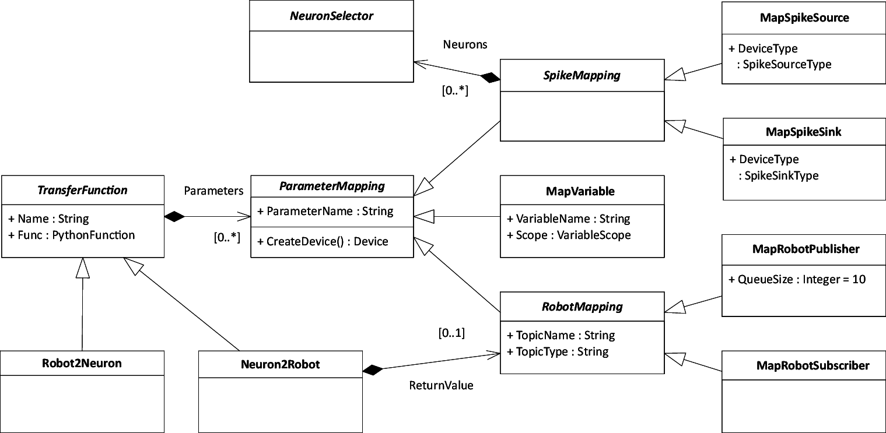

Transfer Functions with PyTF
============================

Abstraction is about concentrating on the essential. To explain what we
see as essential in the connection between a robot and a spiking
neuronal network, we begin with the explanation of the DSL that captures
these essentials.

.. figure:: img/closedLoop.png
   :alt: A Closed Loop between Neuronal Networks and Robots

   A Closed Loop between Neuronal Networks and Robots

Our main metapher for connecting spiking neuronal networks with robots
are Transfer Functions such as sketched in Fig. [fig:closedLoop].
Transfer Functions consist of connections into the simulators and an
executable specification how the data of one simulator should be
transmitted to the other. Ideally, the executable part is trivial as the
purpose of most Transfer Functions is limited to transmission, simple
arithmetic adjustments and multiplexing the data from different parts of
the simulators. The role of the simulators is to some extend
interchangably in that both take information from one simulator and put
it into the other, but the ways how this is implemented differs for
spiking neuronal networks and robots.

Abstract Syntax
---------------

The basic idea behind PyTF is that the functional specification of a
Transfer Function, that is how the input from a Transfer Function is
converted to a robot control signal, can be specified in a regular
Python function. Thus, the effect of PyTF is to wrap Python functions
into Transfer Functions, map their parameters to parts of either
neuronal network or robot simulation and manage the execution of this
function.

   The abstract syntax of PyTF

The abstract syntax of PyTF to achieve this functionality is depicted in
Figure [fig:transferFunctions]. A Transfer Function consists of an
underlying Python Function and parameter mapping specifications.
Multiple types of parameter mappings exist in order to connect to either
neuronal simulation or robotics simulation. In principle, we
differentiate between mappings to the neuronal network
(``SpikeMapping``), to the robotics simulation (``RobotMapping``) and to
internal variables. The mapping specifications for the simulators each
have subclasses to specify whether the parameter is an input or output
to the simulation.

As the parameter mapping specifications are contained in the Transfer
Functions, a Transfer Function does not have external references. In
particular, the deployment of Transfer Functions could be distributed to
multiple nodes in case the Transfer Functions contain computational
expensive transmission logic such as processing of large matrices for
image processing.

All parameter mappings share an attribute specifying which parameter
they belong to and a method to create a device from the mapping
specification. This creates an adapter component instance in case of a
mapping to a simulation or just yields a reference to a local or global
variable. For this, a reference to the surrounding TF Manager is passed
into the mapping specification that contains references to the
communication adapters for both neuronal and robotics simulation. The
mapping specifications can the create the device independently of the
concrete simulator used at either side.

PyTF has two subtypes of Transfer Functions, ``Robot2Neuron`` and
``Neuron2Robot``, represented by the upper and lower Transfer Function
in Fig. [fig:runtime\_components]. The rationale behind this decision is
simply to order Transfer Functions in the unlikely case that a control
topic is both read from and written to. Thus, ``Robot2Neuron`` Transfer
Functions are executed first. On the other hand, ``Neuron2Robot``
Transfer Functions often result in sending a message to a particular
robot control topic. For this rather common case, the class contains a
reference to a publisher so that the Transfer Function may simply use
the return value of the function to publish on this topic. Other than
that, the type of Transfer Functions has no implications to the allowed
parameter mappings. In particular, a ``Robot2Neuron`` Transfer Function
may for example also contain a publisher or a spike sink.

Neuron Access Patterns
----------------------

Whereas robot control signals or sensory inputs from the robot can be
bundled in arbitrary data structures sent over ROS, the interface of a
neuron is determined through its underlying neuron model. In many cases,
this interface is limited to a few parameters such as the membrane
potential or a history of spikes. As a consequence, a single control
signal for a robot is often multiplexed to a multitude of neurons and
vice versa sensory inputs such as a camera image are fed into a
multitude of neurons. Therefore, Transfer Functions often require to
connect multiple neurons at once.

On the other hand, spikes as the usual interface of a neuron in a
spiking neural network are discrete in time whereas control commands for
robots usually consist of continuous data sent to the robot in short
intervals. Likewise, sensory inputs from the robot that shall be
transmitted to the neural network need to be discretized to spikes. To
perform these conversions, there are multiple approaches. This includes
integration of spikes to obtain continuous data from spikes and
generating a current spikes either constantly or according to some
probability distribution, most notably Poisson distributions.

In PyTF, users can choose between a set of access patterns predefined in
the language. Each connection to a particular set of neurons and
according to a given access pattern is realized by an object we call
device (as this terminology is also partially used in the neural
simulators) where the access pattern is called the device type.
Depending on whether the device is an input into the network (spike
source) or an output (spike sink), different device types apply. Each
device can be connected to arbitrary many neurons that can be selected
by navigating through the populations of the neuronal network model.

We support the following spike source device types:

#. **Current Generators:** The current generators for direct current,
   alternating current or noisy current do not generate spikes but
   inject currents of the specified type into all of the connected
   neurons. These devices receive the amplitude of the generated current
   as inputs. Here, the noisy current generator is rather a tool to test
   whether the neuronal network currently simulated is robust with
   regard to noise rather than being a good choice to encode sensory
   inputs.

#. **Poisson Generator:** A Poisson generator issues spikes according to
   a Poisson distribution. Here, the inverse of the :math:`\lambda`
   parameter can be set in accordance to sensory inputs. This inverse
   reflects the rate in which spikes are generated by this device.

#. **Fixed Frequency Generator:** A fixed frequency generator
   deterministically generates spikes at a given frequency. Here, the
   frequency is set as a parameter and can be adjusted to sensory
   inputs. Unlike the other spike generators, this device type is not
   directly implemented in neuronal simulators but can be implemented by
   connecting a current generator with an integrate-and-fire neuron.

This selection is based on the observation that neural simulators as in
particular Nest let simulated neurons communicate through the delivery
of spikes and currents. Based on the experiments we performed so far
using the platform, we believe that this list suffices for most
applications. However, we plan to support new device types should they
be demanded by users of the NRP.

On the contrary, the following spike sinks are supported:

#. **Leaky Integrators:** The concept of leaky integrators is to simply
   integrate spikes coming from a neuron under observation and add a
   leak term to it. The rationale behind this is that in spiking
   neuronal networks, the membrane potential is highly fragile. Shortly
   after a spike has been issued, the membrane potential is reset and
   therefore, it has a high importance whether any measurement is taken
   before or after a neuron spikes. Therefore, we augment the neuronal
   network with an additional leaky integrate-and-fire neuron with an
   infinite threshold potential (so that it never spikes) and measure
   the membrane potential of this neuron. The result is much less
   fragile and therefore appropriate to be used for robot control
   signals.

#. **Population Rate:** Also a very common pattern is to simply take the
   average incoming spike rate of a neuron or a range of neurons. This
   is again relatively stable and can be used for translation into robot
   control signals.

#. **Spike Recorder:** The simplest thing a spike sink can do is to
   simply record all spikes issued to a neuron under observation.
   However, this has two major drawbacks. At first, the communication
   overhead is increased since all spikes are transmitted between the
   neuronal simulation and the Transfer Function but more important, the
   Transfer Function has to make sense of this series of spikes. This
   allows great flexibility as this approach is very extensible, but it
   is not suited for the general case.

Again, this list only contains the device types we deem practical for a
range of applications and we do not claim that this list to be
sufficient for all experiments. This list is subject to change meaning
that poorly used device types may no longer be supported whereas device
types frequently asked for may be added.

The implementation how exactly a given device type is realized is here
up to the communication adapter that will ultimately create the
appropriate communication objects. For example, the leaky integrator
device can be implemented in nest by simply inserting a new
integrate-and-fire neuron with adequately set parameters and an infinite
spiking threshold so that the result is directly available as the
membrane potential of the additionally inserted neuron. This is possible
since the Nest simulator runs in main memory and therefore allows an
arbitrary communication. Other simulators such as SpiNNaker may be based
on spike-based communication, only. Here, the implementation of the
leaky integrator would rather be to record the spikes and do the
integration manually.

Each of these device types has their own additional configuration such
as weights and delays in which the spikes are issued to spike generators
or from existing neurons into leaky integrators. On the other hand, all
devices share the connection specification towards the neuronal
simulator, that we call ``NeuronSelector`` (cf. Fig.
[fig:transferFunctions]). This is a function that given a model of the
neuronal network selects the neuron a device should be connected to.
This includes entire populations but also views and assemblies.

While a single device merely suffices to transmit simple sensory data to
the network or issue command control signals to the robot, the
transmission of complex sensory inputs such as camera images requires
multiple devices connected to different neurons each. This is the reason
that a device mapping can specify not only a single but multiple neuron
selectors. In case multiple neuron selectors are present, the framework
will create not a single device but one for each neuron selector.

The advantage of these device groups is that they aggregate the values
from individual devices to arrays, making this a suitable choice when
the according data in the robotics simulator is also available as
arrays. This is the case e.g. for camera inputs that can then be for
example transmitted to an array of Poisson generators. Furthermore,
device groups can be configured comfortably as in such a scenario
usually all devices share large proportions of their configuration.

Mapping to Python
-----------------

Applying a typical query-and-command programming interface for managing
Transfer Functions would presumably result in verbose schematic code.
Thus, we use techniques from the
area of Domain-Specific Languages to raise the abstraction level of the
target platform by means of an internal DSL, PyTF. With PyTF, we obtain
a more concise representation of Transfer Functions. Users can specify
Transfer Functions as regular Python functions decorated with their
connections to neuronal and world simulator. The coordination regarding
data synchronization and simulation orchestration is hidden in the
platform abstractions.

We chose an internal DSL and Python as a host language mainly because
Python is popular both among robotics and neuroscience users. Given the
research results from Meyerovich that suggest that developers
do not like to change their primary language, we wanted to make the
barrier for neuroscientists as low as possible and therefore created a
Python API. Furthermore, there is an API for both for the neuronal
simulations and the robotics side. As a consequence, large parts of the
framework are implemented in Python and this allows an easy
implementation of the DSL as a Python API.

To implement Transfer Functions in PyTF, we have decided for a decorator
syntax. A first set of decorators turns a regular Python function into a
Transfer Function and a second set of decorators specifies parameter
mappings. Everything else, especially including the neuron access
patterns and device types is specified as parameters for these
decorators.

A consequence of this design is the name of the classes in the abstract
syntax. They are adjusted to yield an understandable syntax when used as
decorators.

In particular, the classes ``Neuron2Robot`` and ``Robot2Neuron`` create
a new Transfer Function object with no reference yet to a regular Python
function. When used as a decorator and applied to a Python function, the
underlying Python function of the Transfer Function is set and
placeholders for the parameter mappings are created (Python allows to
retrieve the parameter names of a method using the ``inspect`` module).

The mapping specification classes ``MapSpikeSource``, ``MapSpikeSink``,
``MapVariable``, ``MapRobotPublisher`` and ``MapRobotSubscriber`` then
create a parameter mapping specification object that when called with a
Transfer Function replace the according placeholder with themselves and
return the Transfer Function to allow other parameters to be mapped. If
no appropriate placeholder exists, an error message is thrown.

The configuration for mapping specifications is passed as arguments to
the decorator representing the parameter mapping. Here, the device
mappings are most interesting since they allow the most detailed
configuration. In particular, they contain a specification to which
neurons a device should be connected as a function selecting the neurons
for a given model of the neuronal network. However, as we do not want
our users to bother with the details of lambda functions where this is
not strictly required, we created a small API to allow them to write
such functions as if they were operating on an assumed neuronal network
model directly.

To specify multiple neuron selectors, a list of neuron selectors must be
passed into the neuronal network constructor. In PyTF, we support a
mapping operator that construct such lists of neuron selectors based on
a lambda function and a concatenation operator to express more complex
patterns. These operators make use of the knowledge that neuron
selectors must not be nested deeper than in one list (i.e. it is not
permitted to specify a list of a list of neuron selectors for a device)
and flatten these lists when required.