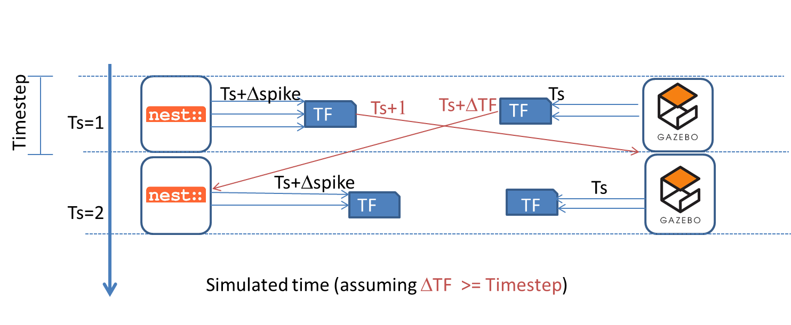
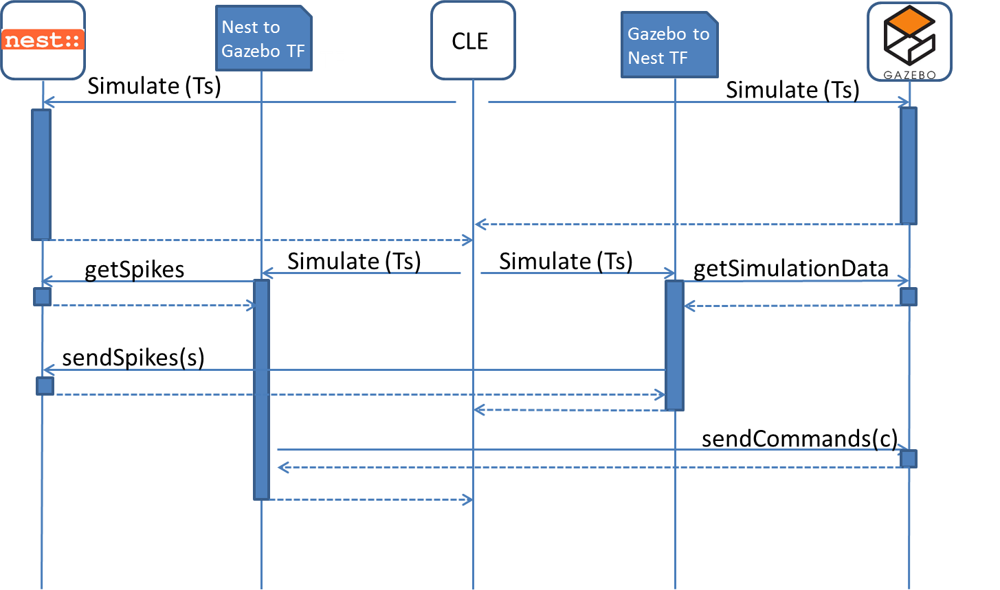

CLE - Simulation Synchronization and Data Exchange
==================================================

Synchronization mechanism
-------------------------

The synchronization solution strongly relies on the capability to control both the simulations in terms of starting and running for a fixed amount of simulated time (timestep).
The idea behind this synchronization mechanism is to let both the simulations run for a fixed timestep, receiving and processing the output of the previous steps and yielding data that will be processed in the future steps by the concurrent simulation.
In other words it is not possible to receive data yielded in the current timestep by the concurrent simulation. This can be read as the time needed for the TFs to output a results is greater than the timestep.
:num:`Fig. #sync-mechanism` shows the proposed synchronization mechanism. In this simulation, NEST produces spikes and send them to the TFs. The output of the TFs can be available at the beginning of the next timestep (or future timesteps) in the Gazebo simulation. The simulation in Gazebo produces the output at the end of the simulation time and it is sent to the TFs. Depending on the output time of the produced spikes by the TFs, they are sent to and processed by NEST at the right time. This synchronization mechanism allows the simulations to run in parallel each step. This means that before starting a new timestep simulation, both have to complete their running in order to keep the execution and the data exchange aligned in time.

.. _sync-mechanism:

   Synchronization of the CLE

Data Exchange
-------------

The CLC is responsible for the control of the synchronization as well as for the data exchange among the Simulations and the TFs. The purpose of the CLC is not only to guarantee that both the simulations start and run for the same timestep, but it also collect data at the end of the simulation in order to make them available for the TFs. The TFs have an internal status synchronized with Nest and Gazebo.
:num:`Fig. #sync-data` shows a sequence diagram of a typical execution of a timestep. After Gazebo and Nest have completed their execution, the TFs receive and process data from the simulations and produce an output which is the input for the next execution. In each timestep, after finishing their simulation step, Gazebo and Nest send an acknowledgment to the TFs (CLE application). At this point two data streams are executed:

1.  Gazebo sends the motor commands generated the previous timestep to the TFs that translate them in spike and send them to NEST.
2.  NEST sends the spikes generated the previous timestep to the TFs that translate them in motor commands and send them to GAZEBO.

Clearly the TFs run for a timestep producing spikes for the next NEST simulation and commands for the execution in GAZEBO.

.. _sync-data:

   Data Exchange between the simulations in the CLE

.. WARNING::

   Currently, there is a Bug in NEST making this solution infeasible. Therefore, we have a completely serialized version of the CLC as backup, i.e. NEST, Gazebo and the TFs run sequentially.
   However, this temporary solution does not utilize the multi-processors of modern hardware sufficiently and thus we want to have the method as described in this document in the long term.