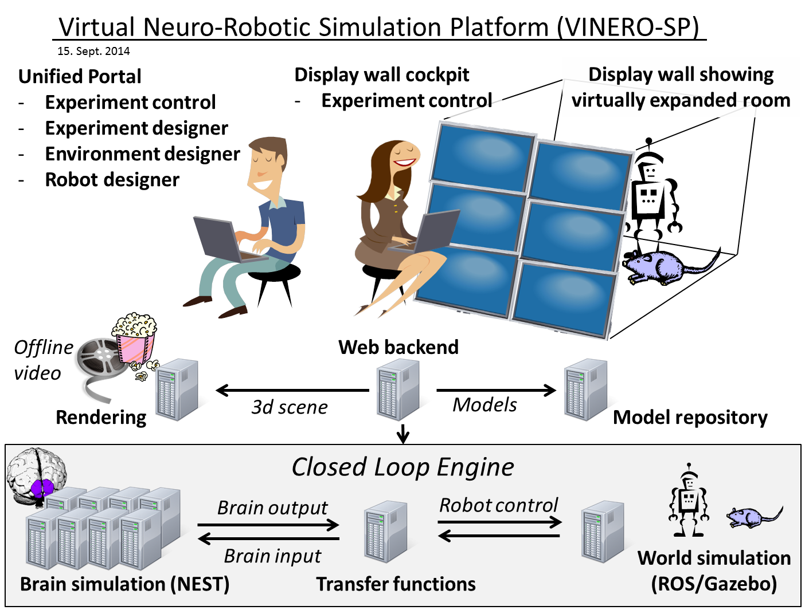

Transfer Functions
==================

Purpose
-------

The transfer functions describe how spikes from the neuronal simulation are to be translated into commands for a robot and how the sensor data from the robot should be translated back to spikes. This translation is specified by the users of the Neurorobotics project, which are neuroscientists. Thus, a framework is provided to make the specification of these transfer functions as easy as possible for the users and abstracting away as much as possible technical details. This framework is referred to as Transfer Functions framework (TF framework). The architecture of this framework is the subject of this document.

The TF framework is part of the CLE: :doc:`CLE architecture<architecture>`

Functional Requirements
-----------------------

The neurons of the NEST brain simulator occasionally send spikes, messages with no data content except for the neuron that sent it and a timestamp. Furthermore, the NEST brain simulator is clocked, i.e. spikes can only be sent in the speed ratio of the brain simulation. However, a neuron does not have to spike in every timeframe.

The transfer functions transfer this spike data into a continuous data stream for the robot, i.e. for every robot topic, a message is sent for every timestep even though no neuron that is needed by the corresponding transfer function has spiked. As a consequence, all transfer functions must be evaluated at every timestep. However, the time resolution for the transfer functions is not necessarily the same as for the brain simulation but can be a multiple of it. Typical time resolutions that we are using are 5ms for the brain simulation and 100ms for the TFs. Within this time span, a neuron may spike up to 100/5=20 times.

For this reason, the spike data from the neuronal simulation is only accessed indirectly through so called devices. In neuronal simulation, devices are little programs that are injected into a neuronal network and run with the same clock as the neuronal simulation and can be accessed from outside. A typical example is a leaky integrator that basically returns the voltage of a neuron. The brain adapters of the CLE e.g. to PyNN do inject such devices into the neuronal network. **However, within the TF framework, we also refer to the adapter objects that connect these devices with the TF framework devices**, so we identify these adapters with the devices that they adapt.

A transfer function may access spikes of arbitrary many neurons and the spikes of a neuron may be used by arbitrary many transfer functions. Consecutive neurons can be grouped together in arrays to make the specification of transfer functions easier, but do not have to. A transfer function may require spikes of both grouped and single neurons.

The transfer functions create (or read, depending on the direction) multiple typed robot topics. The user (i.e. the neuroscientist) is responsible to ensure that the data sent to particular robot topics matches the type of the topic. This may be checked additionally by a compiler, but this feature is not mandatory and is depending on the specification language of the transfer functions.

A common requirement for all transfer functions is that they may hold a state. Furthermore, the state should be sharable among multiple transfer functions to allow maximal flexibility of the framework. The transfer functions should have a specified execution order to get an intuitive understanding of side effects.

Specifically for the transfer function from the robot sensors to the neuronal simulator, the TF framework should establish the least possible amount of assumptions on the spike generation schemes, i.e. there should be no restriction to the patterns in which spikes are sent to the neurons. However, neuroscientists should be able to specify common spike generation schemes like frequencies, i.e. to send spikes to a particular neuron in a frequency that is possibly higher than the incoming rate of sensor data.

Technical Requirements
----------------------

In the neuroscience community, the programming language Python has gained a good popularity. Thus, it is important to allow neuroscientists to specify TFs in Python. Further considerations to use C++ were abandoned at the moment, as the simulator is also controlled using Python. Furthermore, we can use CPython to convert Python code to C if want to reduce the performance impact of using Python.

Architecture Overview
---------------------

The Transfer Functions are a part of the Closed Loop Engine (CLE) and are situated between the neuronal simulator (“the brain”) and Gazebo as our world simulation engine (WSE). Thus, they have an interface to the neuronal simulator at the one hand and an interface to Gazebo at the other hand. However, to ensure that we can test the transfer functions separately, the communication both to the neuronal simulator and to Gazebo is hidden behind interfaces and the functionality is provided to the TF framework by adapters.

:num:`Figure #tf-overview` shows the architecture of the CLE. The transfer functions are the important component in the middle that transfers data between the two simulators, being the neuronal simulator at the one side and the world simulation engine at the other. Both Simulators are accessed through adapters that represent their functionality and can be replaced with appropriate mocks when necessary. The transfer functions are controlled by the Closed Loop Controller which is responsible to orchestrate the transfer functions with the simulations. The ROS adapter implements the Robot Communication Adapter interface via publishing and subscribing ROS topics, whereas the PyNN Brain Adapter fulfills its interface by delegating the calls to NEST via the PyNN interface. This common interface allows us to use either NEST, SpiNNaker, Neuron or a mock.

.. _tf-overview:

   Architecture of the Closed Loop Engine

The interfaces relevant for the above architecture of the CLE are shown in :num:`Fig. #tf-interfaces`. The transfer functions provide three methods that initialize them and call the transfer functions in either direction.

.. _tf-interfaces:
.. figure:: img/architecture_interfaces.png
   :align: center

   Interfaces of the Closed Loop Engine

On the other hand, the transfer functions will rely on the interfaces for the robot communication and the communication to the neuronal simulator. Both communication adapters provide an interface to initialize them register that data will eventually be retrieved or sent. For this purpose, the transfer functions call the appropriate adapter to create a communication object that can be used to send or receive data. Appropriate interfaces for such communication objects exist for both robot and neuronal simulator sides.

On the side of the neuronal simulator, the interface is dependent on the used device type, whereas the interface for the robot adapter is fixed. This is due to the fact that all robot properties are exposed through topics, whereas the data from the neuronal simulation are most efficiently fetched using devices. That is, the neuronal simulation is instrumented with devices that run within the neuronal simulator and get executed by the neuronal simulator for every timestep of the neuronal simulator. These devices can either record the spikes in a certain way or are allowed to issue spikes. Typically, these devices have a low configuration overhead, a frequency-based spike generator for instance only needs the frequency in which to issue spikes.

The initially supported spike detectors are a voltage device and a spike recorder device. The first simply records the voltage of a neuron at a given time, whereas the spike recorder records whether a particular neuron has spiked over the last period of time. The supported spike generation patterns include for the start a fixed frequency, a Poisson-based spike generation and a pattern spike generator.

Thus, the architecture for the TF framework foresees to communicate with the neuronal simulator only through such devices in order to minimize the communication overhead and maximize performance.

An important requirement for the TF framework is that only those spikes should be transferred to the TF nodes that the TF node needs, for the robot topics likewise. To lower the amount of specification that we need from the user, this information should be extracted from the specification of the transfer functions.

Thus, a specification of a transfer function in accordance to our architecture consists of three parts, where we distinguish between two different kinds of transfer functions. The first kind, Neuron2Robot, transfers spikes from the neuronal simulator to topics for the WSE. The other kind, Robot2Neuron transfers data in the other way round.

Each of these transfer function specifies the data sources from which it receives data. For Neuron2Robot, this is typically neuronal simulator devices (a transfer function may receive input from multiple devices), whereas for Robot2Neuron it is robot topics, where again multiple topics are allowed. However, both Neuron2Robot and Robot2Neuron transfer functions may consume data from either simulation.

The second part of the transfer function is the specification of the result, i.e. the specification to which output the data should be sent. For a Neuron2Robot transfer function, this typically is a robot topic but there is no limitation. Both Neuron2Robot and Robot2Neuron transfer functions may target robot topics, brain devices or a combination of both.

The third part of a transfer function is the actual function, i.e. the specification how the robot topics and device configuration (either for sending or receiving data) is connected. This specification can be done through arbitrary Python code. The data source is fed into the function as a formal parameter, whereas the return value is taken and sent to the target sink, i.e. the targeted robot topic or device. Further communication is possible through communication objects directly.

A quick overview on how these concepts are implemented in the TF framework can be found :doc:`here<tutorial_tf>`.

Transfer Function Framework Architecture
----------------------------------------

Initialization
^^^^^^^^^^^^^^

The Initialization of a TF node is straight forward. In the initialization, the TF node is supposed to initialize the adapters for both robot and the neuronal simulator. The initialization also includes the setup and registration of the transfer functions, i.e. to connect the transfer functions with their necessary communication objects.

These communication objects (robot publishers or subscribers, brain devices) are declared in annotations of the transfer function that map a parameter to a given communication object specification. The transfer function manager resolves this specification and creates an appropriate communication object for this request.

.. _tf-initialization:
.. figure:: img/tf_initialization.png
   :align: center

   Initialization of a TF node

The sequence of the initialization is shown in :num:`Fig. #tf-initialization`. The initialization of the TF node is triggered from the closed loop controller, either through in-process communication or remotely. The TF node then makes sure that the dependent adapters are initialized and creates the communication objects necessary for the transfer functions.

However, the sequence in Figure 3 only visualizes the normal case that Neuron2Robot transfer functions actually transfer neuronal spike data to robot streams and likewise for Robot2Neuron. In the general case, a Neuron2Robot transfer function may also generate spikes or use a topic subscriber whereas a Robot2Neuron transfer function may access neuronal spike sinks such as voltmeters as well. The distinction between Neuron2Robot and Robot2Neuron is merely to adjust the effort necessary to run the transfer functions in either way so that the transfer functions of either way can be executed in parallel. Thus, the registration at the communication adapter is routed through the parameter mapping object, i.e. the annotation that maps the parameter to the communication object.

Running the transfer functions
^^^^^^^^^^^^^^^^^^^^^^^^^^^^^^

Due to the requirement to run transfer functions even in the case that no neuron accessed by a transfer function spiked, we need the TF framework to run clocked synchronized with the NEST brain simulation, but with a lower time resolution than the neuronal simulator. Responsible for this synchronization is the closed loop controller, which calls the transfer functions.

As the spikes from a neuron can be accessed by multiple transfer functions, the current state of a device from the neuronal simulator is cached in the TF node. The same holds for robot topics, where incoming messages are buffered to be processed by transfer functions separately.

The sequence diagram for a TF node implementing transfer functions in both directions is shown in :num:`Fig. #tf-iteration`. At any time, the TF node may receive incoming data from the robot via callbacks of subscribed ROS topics. These calls simply update the cached current status of the robot sensors.

.. _tf-iteration:
.. figure:: img/tf_iteration.png
   :align: center

   Iteration of a TF node

Once again, only the standard case where Neuron2Robot transfer functions transfer from the neuronal simulator to the robot and vice versa for the Robot2Neuron transfer functions is shown. Furthermore, unlike in Figure 4, refreshing the devices on either side is now done directly by the Closed Loop controller and no longer by the TF manager.

Eventually, the closed loop controller calls the TF node to either run all transfer functions transferring data from the neuronal simulator to the WSE or vice versa. These calls may also be done in parallel. Thus, the methods from the TF node to run either transfer functions must be thread-safe.

When the closed loop controller asks the TF node to call all transfer functions that transfer robot messages to spikes for the neuronal simulator, the TF node runs all Robot2Neuron transfer functions. Within the body of these functions, the device status may be updated. This device is given to the transfer function also as a formal parameter. As data source, the cached values from the buffered robot messages are used.

Conversely, the closed loop adapter may also call the TF node to run the transfer functions from the neuronal simulator to robot messages. For this, the TF node will call the brain adapter to refresh all cached device states. Then, the Neuron2Robot transfer functions are called. They take the current cached device status as input and return some value or the default value None. The return value of these transfer functions is sent to the predefined robot message by the TF framework. However, Neuron2Robot transfer functions are also allowed to send messages on their own within their function body.

Thus, all transfer functions are evaluated at every simulation loop of the Closed Loop Engine, but possibly on a lower time resolution than the neuronal simulator. They operate on buffered data from the robot sensors, but also get a flag indicating whether these values have changed since the last loop. Transfer functions are evaluated in order of their appearance in the specification so that side effects happen in an intuitive manner. Sophisticated spike generation patterns are subject of further helper classes.

The patterns for the spike generators are supported by custom spike generator classes, which are implemented separately and called within the transfer function. This design makes it easier to import other spike generators as neuroscience discovers new spike generation patterns.

Device specification
^^^^^^^^^^^^^^^^^^^^

Unlike the robotic simulation whose elements are identified simply by a topic and its type, the interaction mechanisms to interact with the neuronal simulator are richer, particularly because the neuronal simulation typically runs on a higher time resolution than the TFs and any interaction needs to run with maximum performance which often requires specialized solutions.

There are two main elements that make up a device specification.

Device type specification
"""""""""""""""""""""""""

The first one is a specification of the device type and the second one is the specification of the neurons that should be connected to the device.

The device type specification is very simple if predefined device types are used. This includes the following spike sinks:

*   Spike Recorder: Simply tells whether any spike was issued to the device
*   Leaky integrator alpha: Gets the membrane voltage of a current-based LIF neuron with alpha-shaped post-synaptic currents
*   Leaky integrator exp: Gets the membrane voltage of a current-based LIF neuron with decaying-exponential post-synaptic current
*   Population Rate: Gets the frequency of incoming spikes

and the following spike sources:

*   Fixed frequency: Generates spikes at a fixed frequency. The rate sets the frequency in which spikes are generated.
*   Poisson: Generates spikes based on a Poisson distribution. The rate sets the parameter of the Poisson distribution.
*   AC, DC and NC source: Issue current to connected neurons. The amplitude defines the maximal current issued to the neurons.

Additionally, developers may add custom devices that can take over the coupling to a neuronal simulator given a brain communication adapter.

Neuron selection specification
""""""""""""""""""""""""""""""

The second specification item for a device is the specification of the neurons that should be connected to the device. Whereas robot topics can be easily identified by their topic names, we designed the neuron selection to be adjustable by the developer. At the same time, we want the neuron selection to be decoupled from the brain in order to decouple it from the actual neuronal simulator.

This decoupling is especially important since the neuron selection must be possible before the brain (i.e. the neuronal network that is to be simulated) is initialized. This is because the TFs are decoupled from the brain simulation and can thus be specified before the brain is loaded. The brain must only be available when the TF manager is initialized and binds the TFs to a particular brain communication adapter and robot communication adapter.

For this reason, we invented a property path indexing mechanism. That is basically, we record the navigation from an assumed brain model root element and replay the navigation as soon as we have the brain model initialized.