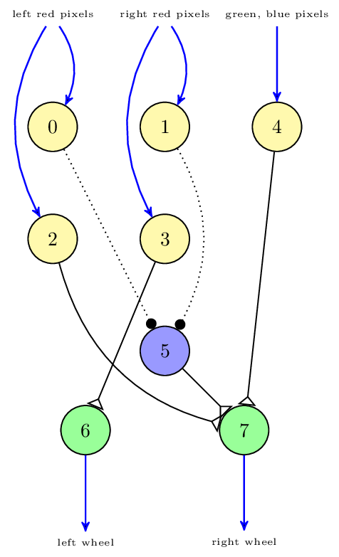

Tutorial: Tutorial Setup
========================

The tutorial series starting with this section will introduce the TF framework given the simple
Braitenberg vehicle experiment that is introduced in this section.

In the Braitenberg experiment, a simple vehicle looks out for a red camera image.
In our version, the vehicle is a robot model called Husky. This robot has four wheel motors and a
camera sensor. The robot can be controlled via two ROS topics,
one for the motors and one for the camera image. In particular, via the motor topic, the Husky may
be assigned both velocity and rotation. Via the camera topic,
camera images can be obtained with about 25fps.

To make the Husky robot detect red colors, the camera image must be analyzed. For this, a very
simple neuronal network with only 8 neurons is used. This network can be seen in :num:`Fig. #braitenberg-network`.

.. _braitenberg-network:

    The neuronal network of the Braitenberg demo

The data from the camera is divided into red pixels on the right side, red pixels on the left side
as well as green and blue pixels of all over the image. This image data is fed into
five **sensor neurons 0 to 4**, shown in light yellow. The reason to have two neurons connected to
the right pixels of either side is the technical restriction that a neuron in some simulators can only
be either inhibitory or excitatory. The sensor neurons operate on the **internal neuron 5** shown
in light blue and the **actor neurons 6 and 7** shown in green. The voltage of the actor neurons
is then to be converted to motor voltages for the robot.

In a typical setting for the tF framework, the neuronal network is already given, i.e. only the
transfer functions need to be specified. These functions are shown in :num:`Fig. #braitenberg-network`
as thick blue arrows.
One can already see in :num:`Fig. #braitenberg-network` the two different kinds of transfer functions,
namely transfer functions from the robot sensors to the neuronal network as the blue arrows at the top
and vice versa at the bottom.

However, the Husky robot does not offer a topic with the left or right red pixels or the left wheel
voltage. Thus, the task of the transfer functions (called TFs for brevity) is to **bridge the gap
between the neuronal network and the robot**.
In particular, the image stream as offered by the Husky needs to be analyzed for its right and left
red pixels. Conversely, the left wheel and right wheel neuron voltages must be processed by a TF to
convert them in a format that the Husky robot can understand.

.. note::
    The task of transfer functions (TFs) is to bridge between the neuronal simulator and the robot
    (world) simulator.

As a consequence, the Braitenberg demo consists of two TFs. The first **Robot2Neuron TF** converts
the image stream from the Husky robot to spikes for the sensor neurons *0* to *4*.
A second **Neuron2Robot TF** converts the wheel neurons voltages back to velocity commands that can
be processed by the Husky.

If you have understood the Braitenberg demo, you may want to continue with :doc:`bibi_config`.